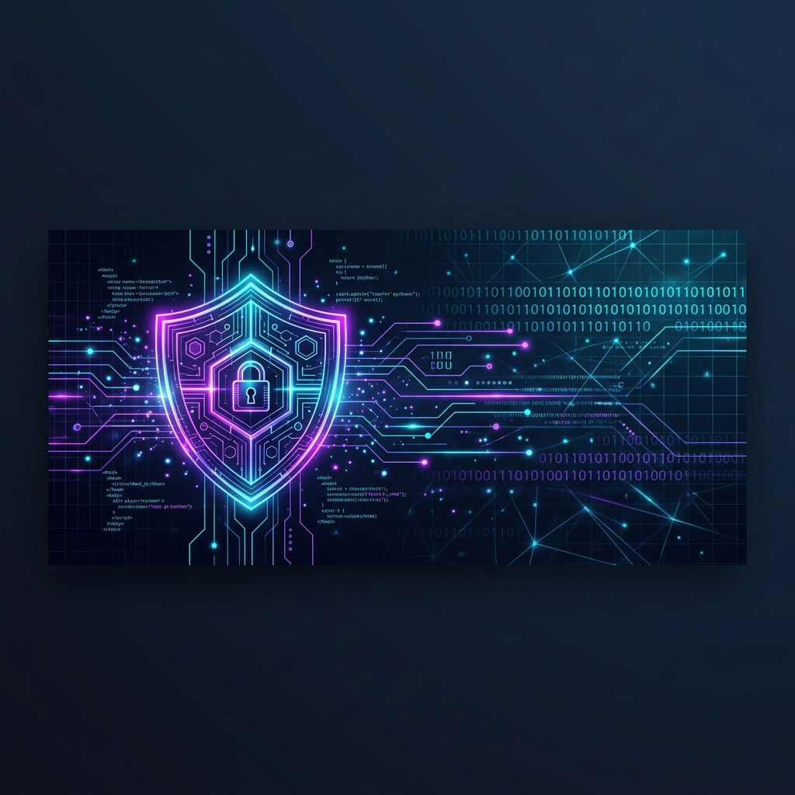

#This whole radme file created by ai. vibe cording hits hard 

  

<h1 align="center">Hi 👋, I'm Seni</h1>

  <b>🛡️ Cybersecurity Student | 💻 Web Developer | 🐧 Linux Enthusiast</b>

  

## 🚀 About Me

- 🎓 Currently pursuing studies in **Cybersecurity**, focusing on penetration testing, security auditing, and network security.
- 🌐 Building modern, secure, and user-friendly web applications using **JavaScript** and modern frameworks.
- 🐧 Linux power user who enjoys system optimization, bash automation, and exploring open-source tools.
- 🧠 Actively learning new hacking techniques, secure coding practices, and participating in CTF challenges.

## 🛠️ My Tech Stack

### 💻 Languages & Scripting

  
  
  
  
  

### 🛡️ Cybersecurity & Pentesting

  
  
  

### 🐧 Operating Systems

  
  
  

### 🔧 Tools & Technologies

  
  
  
  

## 📊 GitHub Statistics

  
  

